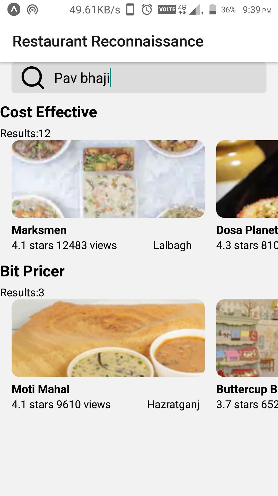
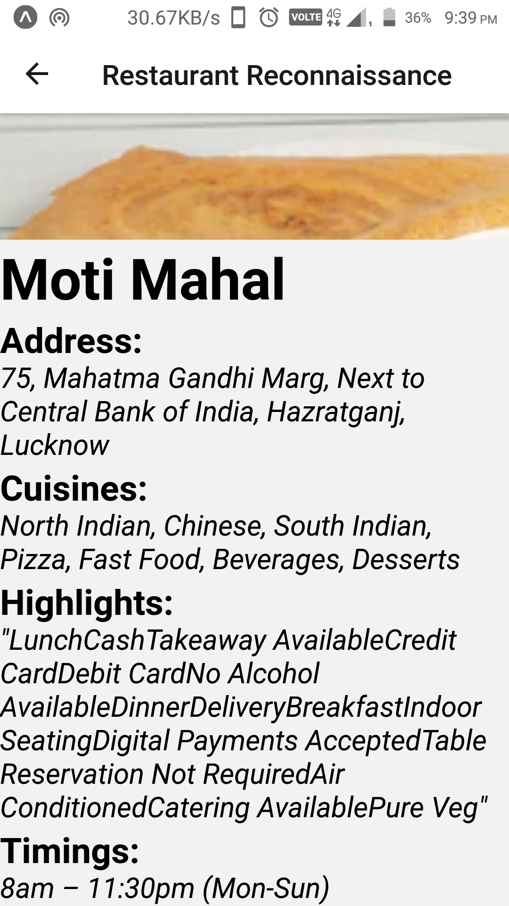

# Restaurant-Search-app
## React-Native app 
**Searches restaurants of Lucknow based on favourite food items and sorts them according to expensiveness.**
### **Uses Zomato api for live loading and searching**
#### *To use this project simply download it and run **npm install** to install all dependancies.*
#### *To run the project use **npm start**.*
#### *Don't forget to change user-key*

 

*First page visible through default search item*

&nbsp;&nbsp;&nbsp;&nbsp;&nbsp;&nbsp;&nbsp;

*1st screen showing restaurant available through search-item "pav-bhaji".On clicking upon restaurant it displays various information about that restaurant shown by 2nd screen*